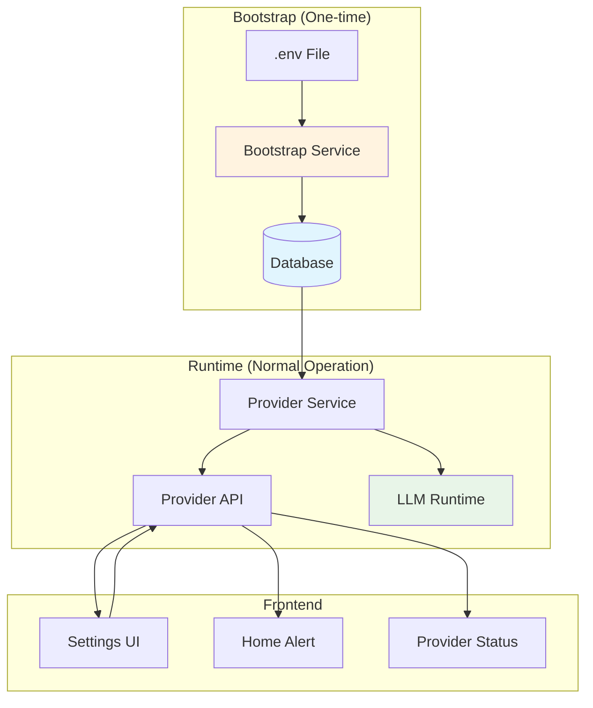

# Design Document

## Overview

The provider settings synchronization feature addresses the disconnect between backend LLM provider configuration and frontend display by implementing a **Database-First** approach that eliminates configuration confusion and provides a single source of truth.

The solution implements a simplified configuration management system that:
1. Uses the database as the single source of truth for all provider configurations
2. Automatically imports existing .env configuration on first startup (bootstrap)
3. Provides seamless UI management of all provider settings
4. Eliminates the complexity of managing multiple configuration sources

## Architecture

### Current State Analysis

**Backend Configuration Flow:**
- Environment variables (.env) → LLMConfig → Runtime LLM instances
- Database (DBProvider table) → API endpoints (partially implemented)
- No synchronization between .env and database

**Frontend State:**
- Attempts to load providers from database API
- Shows errors when API calls fail
- Cannot determine actual active provider
- Form validation and error handling incomplete

### Database-First Architecture



**Key Principles:**
1. **Single Source of Truth**: Database is the only source for provider configurations
2. **Bootstrap Once**: .env is imported to database only on first startup
3. **UI-Driven**: All provider management happens through the UI
4. **Runtime Simplicity**: LLM always reads from database

## Components and Interfaces

### Backend Components

#### 1. Bootstrap Service
**File:** `backend/services/bootstrap_service.py`

```python
class BootstrapService:
    def import_env_to_database() -> bool
    def is_first_startup() -> bool
    def mark_bootstrap_complete() -> None
```

**Responsibilities:**
- One-time import of .env configuration to database
- Detect first startup vs. normal operation
- Mark bootstrap as completed

#### 2. Configuration Service (Simplified)
**File:** `backend/services/config_service.py`

```python
class ConfigService:
    def get_active_provider() -> ProviderConfig
    def validate_provider_config(config: ProviderConfig) -> ValidationResult
    def get_provider_status() -> ProviderStatus
```

**Responsibilities:**
- Read active provider from database only
- Validate provider configurations
- Provide system status information

#### 2. Provider Management Service
**File:** `backend/services/provider_service.py`

```python
class ProviderService:
    def list_all_providers() -> List[ProviderConfig]
    def get_active_provider() -> ProviderConfig
    def create_provider(config: ProviderConfig) -> ProviderConfig
    def update_provider(id: int, config: ProviderConfig) -> ProviderConfig
    def delete_provider(id: int) -> None
    def set_active_provider(id: int) -> ProviderConfig
    def test_provider_connection(config: ProviderConfig) -> TestResult
```

**Responsibilities:**
- CRUD operations for providers
- Provider activation/deactivation
- Connection testing
- Configuration validation

#### 3. Enhanced Provider API
**File:** `backend/api/providers.py` (enhanced)

New endpoints:
- `GET /api/providers/status` - Overall provider status
- `POST /api/providers/{id}/test` - Test provider connection
- `DELETE /api/providers/{id}` - Delete provider
- `POST /api/providers/{id}/activate` - Set as active provider
- `POST /api/providers/sync` - Force sync between .env and database

### Frontend Components

#### 1. Provider Status Hook
**File:** `frontend/src/hooks/use-provider-status.ts`

```typescript
interface ProviderStatus {
  hasActiveProvider: boolean;
  activeProvider?: ProviderConfig;
  configurationIssues: string[];
  isLoading: boolean;
  error?: string;
}

export function useProviderStatus(): ProviderStatus
```

#### 2. Enhanced Provider Settings Component
**File:** `frontend/src/components/llm-provider-settings.tsx` (enhanced)

New features:
- Real-time provider status updates
- Connection testing
- Better error handling and validation
- Provider activation controls
- Sync status indicators

#### 3. Provider Alert Component
**File:** `frontend/src/components/provider-alert.tsx`

```typescript
interface ProviderAlertProps {
  status: ProviderStatus;
  onDismiss?: () => void;
  onNavigateToSettings?: () => void;
}
```

## Data Models

### Enhanced Provider Configuration

```typescript
interface ProviderConfig {
  id?: number;
  name: string;
  provider_type: 'openai' | 'azure';
  is_active: boolean;
  is_from_env: boolean; // New: indicates if loaded from .env
  
  // Common fields
  api_key: string;
  model?: string;
  
  // Azure-specific
  endpoint?: string;
  deployment?: string;
  api_version?: string;
  
  // Status fields
  is_valid: boolean;
  validation_errors: string[];
  last_tested?: string;
  connection_status?: 'connected' | 'failed' | 'untested';
}
```

### Provider Status Response

```typescript
interface ProviderStatusResponse {
  has_active_provider: boolean;
  active_provider?: ProviderConfig;
  total_providers: number;
  configuration_source: 'env' | 'database' | 'mixed';
  issues: ConfigurationIssue[];
}

interface ConfigurationIssue {
  type: 'missing_env_var' | 'invalid_config' | 'connection_failed';
  message: string;
  severity: 'error' | 'warning';
  provider_id?: number;
}
```

## Error Handling

### Backend Error Handling

1. **Configuration Validation Errors**
   - Missing required fields
   - Invalid API endpoints
   - Malformed API keys

2. **Database Errors**
   - Connection failures
   - Constraint violations
   - Migration issues

3. **Provider Connection Errors**
   - API authentication failures
   - Network timeouts
   - Invalid endpoints

### Frontend Error Handling

1. **API Communication Errors**
   - Network failures
   - Server errors
   - Timeout handling

2. **Form Validation Errors**
   - Required field validation
   - Format validation
   - Real-time validation feedback

3. **State Management Errors**
   - Loading state management
   - Error state recovery
   - Optimistic updates

## Testing Strategy

### Backend Testing

1. **Unit Tests**
   - Configuration service logic
   - Provider validation
   - Database operations
   - API endpoint responses

2. **Integration Tests**
   - .env to database sync
   - Provider activation flow
   - API endpoint integration
   - Database migrations

3. **Connection Tests**
   - OpenAI API connectivity
   - Azure OpenAI connectivity
   - Error response handling

### Frontend Testing

1. **Component Tests**
   - Provider settings form
   - Provider status display
   - Error state rendering
   - Loading state handling

2. **Hook Tests**
   - Provider status hook
   - API integration
   - State updates

3. **Integration Tests**
   - End-to-end provider management
   - Form submission flow
   - Error recovery scenarios

### Manual Testing Scenarios

1. **Fresh Installation**
   - No .env file
   - Empty database
   - First-time setup

2. **Migration Scenarios**
   - Existing .env configuration
   - Database migration
   - Configuration sync

3. **Error Scenarios**
   - Invalid API keys
   - Network failures
   - Malformed configurations

## Implementation Phases

### Phase 1: Backend Foundation
- Create ConfigService and ProviderService
- Enhance database models
- Implement configuration sync logic
- Add new API endpoints

### Phase 2: Frontend Enhancement
- Create provider status hook
- Enhance settings component
- Implement provider alert component
- Add connection testing UI

### Phase 3: Integration & Testing
- End-to-end testing
- Error handling refinement
- Performance optimization
- Documentation updates

## Security Considerations

1. **API Key Protection**
   - Secure storage in database
   - Masked display in UI
   - Encrypted transmission

2. **Input Validation**
   - Server-side validation
   - SQL injection prevention
   - XSS protection

3. **Access Control**
   - Authentication for provider management
   - Rate limiting for API calls
   - Audit logging for configuration changes